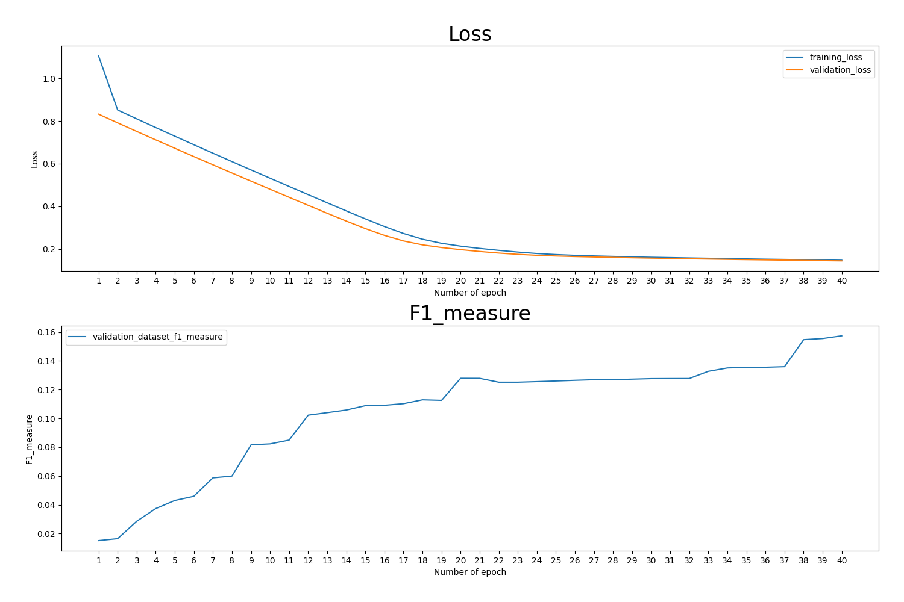
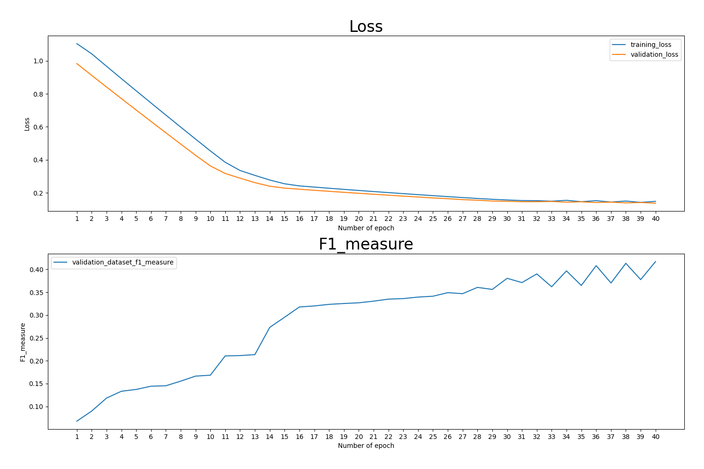
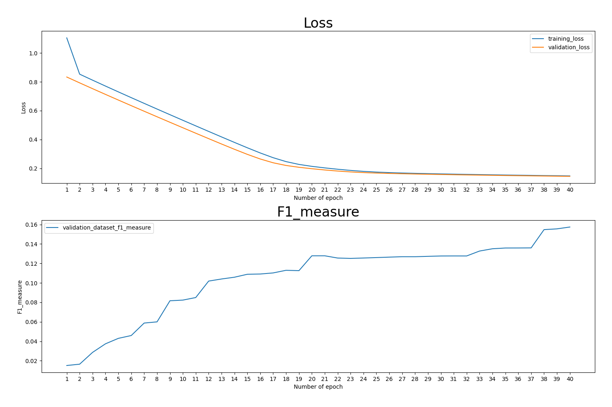
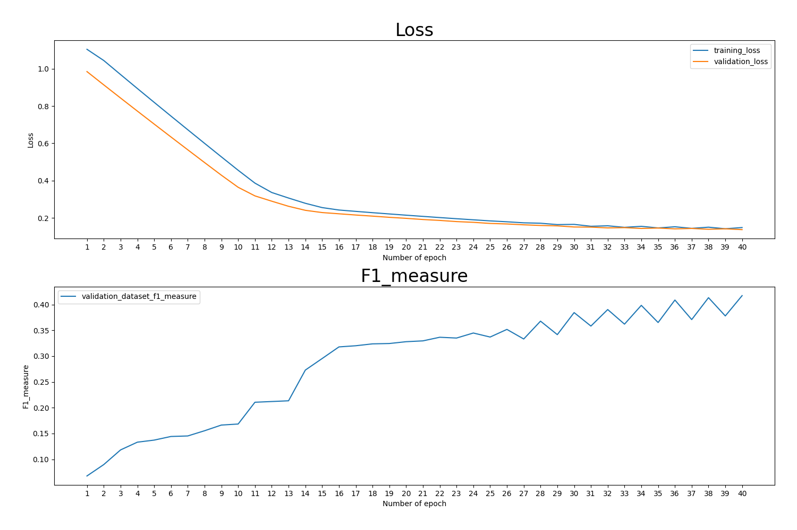
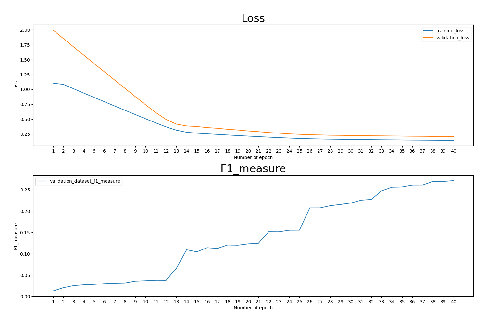
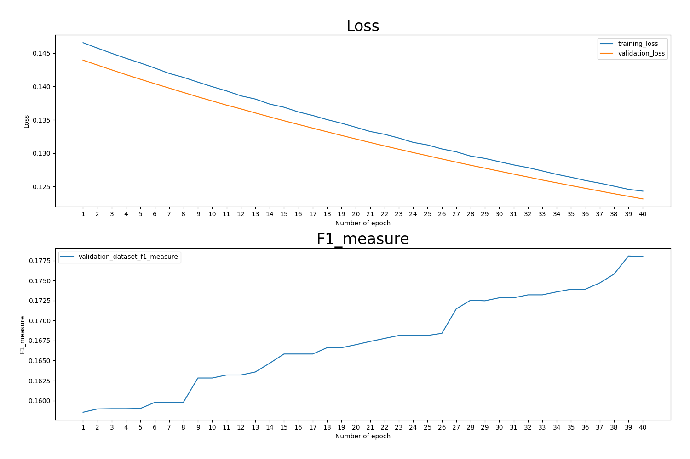
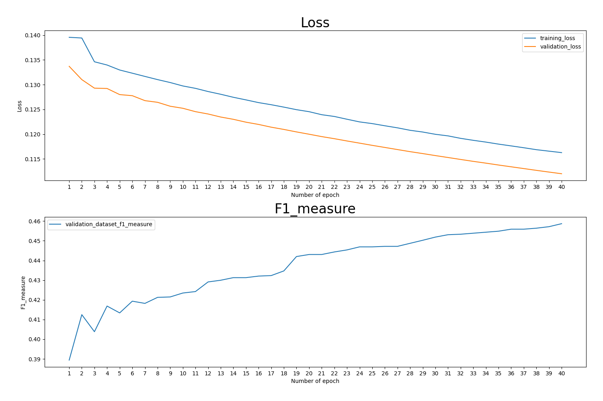
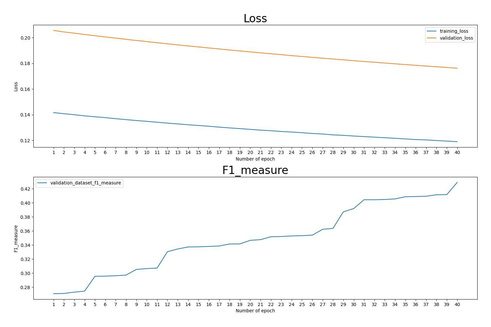

<h1 align = "center">《知识工程》命名实体识别任务实验报告</h1>

07032001 苗沂坤 1120201064

## 1. 实验目的
&emsp;&emsp;完成自然语言处理（nlp）中经典的**命名实体识别任务**。需要先对于语料进行学习，完成对文段语句中的机构名、地名、人名进行预测并标注。其中相关语料已经经过分词、标注词性处理。

## 2. 系统环境及代码说明
* python解释器版本
`Python 3.9.7 [MSC v.1916 64 bit (AMD64)] on win32`
* 使用的第三方库
  1. `pytorch == 1.11.0`，用于提供训练所需要的`tensor`容器以及自动求导功能。
  2. `matplotlib == 3.4.3`，用于作图分析模型在训练过程中的变化。
* 文件架构以及作用说明
  1. `./source/`文件夹中储存本次实验的所有源代码
     - `./source/main.py`为实验的主程序代码
     - `./source/data_process.py`为数据处理代码
     - `./source/model_evaluate.py`为测定模型相关参数代码
     - `./source/training.py`包含了自动求导和手动求导的训练代码
  2. `./screen_autograd0.pdf`第一次自动求导梯度下降过程的相关数据
  3. `./screen_autograd1.pdf`第二次自动求导梯度下降过程的相关数据
  4. `./screen_manualgrad0.pdf`第一次自动求导梯度下降过程的相关数据
  5. `./report.pdf`即为本实验报告
## 3. 实现方法
### 3.1 预处理方法
1. 扫描语料文件，以空格作为分隔符，提取出每个词语的**内容**以及**词性**（其中机构名为nt，地名为ns，人名为nr，姓为nrf，名为nrg），放于列表`list()`中形成二元组。并将所有的二元组放置于列表`word`中。对于开头出现的日期信息，统一标注为`['#开头#','m']`，与模型预测需要的语料意义相符。
2. 按照词性，对于所有列表`word`中的元素添加标记，构成列表`data`。列表`data`中的元素前两维和列表`word`相同，第三、四、五维分别代表了**机构名**、**地名**、**人名**的标记。标记有$O,B,I$三种，分别用整数$0,1,2$代替。其中，$O$代表这个词不属于相应类型，$B$表示这个词为相应类型短语的开头（或当短语只包含一个词的时候），$I$表示这个词为相应短语非开头部分。标记时先按照单个词的词性进行标记，然后考虑复合名称的情况覆盖原有标记。由于数据集有一定错误，对于复合名称长度大于10的复合名称进行**舍弃**。
3. 需要对于每个词提取出其**前一个**以及**后一个**词语，采用`one-hot`编码方式形成一个一维向量，这个向量对应了三个词语对于的编号。这个词语所对应的机构名、地名、人名标记为这个一维向量三个输出值。构建`one-hot`编码需要一个字典`dict`来将每一个词语映射到一个整数上。这里我们提取了语料中最经常出现的`650`个词，即字典大小`dict_size = 650`，将其中每个词映射到`[1,650]`中的整数上。（未出现在字典里的词将映射为$0$）
4. 经过前三步的操作，对于**每个词**我们得到了一个大小为$3*651$的向量和一个大小为$3$的向量，分别作为模型的输入值和输出值。我们将这两个向量转化为`torch.tenser`类型的变量，分别放入列表`x_tlist`和`y_tlist`中以便后续训练。

### 3.2 通过广义线性模型GLM构建Softmax模型
&emsp;&emsp;不妨设模型输入和输出分别为$X,Y$，其中$X$为上文提到的大小为$3*651$的向量（未出现的词映射为0），$Y$为一个在$\left \{ 0, 1, 2 \right \}$中取值的整数（通过构建三个这样的模型来分别预测机构名、地名、人名的标签）。
$$ P(Y=0|X)=\phi_0,P(Y=1|X)=\phi_1,P(Y=2|X)=\phi_2$$
由`Softmax`模型相关理论可以有如下定义：
$$
\phi_0=\frac{e^{\theta_0^TX}}{\Sigma_{i=0}^{2} e^{\theta_i^TX}},\phi_1=\frac{e^{\theta_1^TX}}{\Sigma_{i=0}^{2} e^{\theta_i^TX}},
\phi_2=\frac{e^{\theta_2^TX}}{\Sigma_{i=0}^{2} e^{\theta_i^TX}}(其中\theta_2=0)
$$
这里，$\theta_0,\theta_1$为需要优化的参数，可以写出对数似然函数为：
$$l(\theta)=\Sigma_{l=0}^{m}\ln\frac{e^{\theta_{Y(l)}^TX}}{\Sigma_{i=0}^{2} e^{\theta_i^TX}}(其中Y(l)为第l个样本的标签)$$
取损失值`loss=-l`进行梯度下降进行参数优化，即可得到最大似然估计下的参数$\theta_0,\theta_1$的值。
### 3.3 通过梯度下降进行参数优化
#### 3.3.1 自动求导
&emsp;&emsp;自动求导即通过样本求出对应的`loss`值，并调用方法`loss.backword()`即可得到$\theta$的梯度值`theta.grad`，根据学习率`learning_rate`进行梯度下降`theta -= learning_rate * theta.grad`即可。
#### 3.3.2 手动求导
&emsp;&emsp;需要通过数学推导直接得出梯度值`grad`的表达式，即$grad=\frac{\mathrm{d}l(\theta)}{\mathrm{d}\theta}$，不妨设$z_i=\theta_i^TX$，即有$\phi_i=\frac{e^{z_i}}{\Sigma_{k=0}^{2} e^{z_k}}$，则由链式法则：
$$
\frac{\partial l(\phi_0,\phi_1,...,\phi_m)}{\partial z_i}=\frac{\partial l}{\partial \phi_0}\frac{\partial \phi_0}{\partial z_i}+\frac{\partial l}{\partial \phi_1}\frac{\partial \phi_1}{\partial z_i}+...+\frac{\partial l}{\partial \phi_m}\frac{\partial \phi_m}{\partial z_i}$$
其中：
$$
\left\{
  \begin{array}{}  
             \frac{\partial l}{\partial \phi_i}=-\frac{1}{\phi_i}, Y=i\\  
             \frac{\partial l}{\partial \phi_i}=0, Y\neq i\\  
  \end{array} 
\right.
$$
对于$\frac{\partial \phi_k}{\partial z_i}$则需要分情况讨论。当$k\neq i$时：
$$
\phi_k=\frac{e^{z_k}}{\Sigma_{j=0}^{2} e^{z_j}}\\
\frac{\partial \phi_k}{\partial z_i}=\frac{-e^{z_k}e^{z_i}}{(\Sigma_{j=0}^{2} e^{z_j})^2}=- \phi_ k\phi_i
$$
当$k=i$时：
$$
\phi_k=\frac{e^{z_k}}{\Sigma_{j=0}^{2} e^{z_j}}\\
\frac{\partial \phi_k}{\partial z_i}=\frac{e^{z_i}(\Sigma_{j=0}^{2} e^{z_j})-e^{z_i}e^{z_i}}{(\Sigma_{j=0}^{2} e^{z_j})^2}=\phi_i(1-\phi_i)
$$
又易得到：
$$\frac{\partial z_i}{\partial \theta_i}=X$$
再由链式法则可得：
$$\frac{\partial l}{\partial \theta_i}=(\phi_i-[Y=i])X(其中[Y=i]为示性函数)$$
得到`grad`后同自动求导，根据学习率`learning_rate`进行梯度下降`theta -= learning_rate * theta.grad`即可。
## 4. 运行结果及分析
### 4.1 说明
&emsp;&emsp;`loss`值在程序中除以了样本总数`trainint_cnt`以归一化处理。根据经验，设置学习率`learning_rate = 70`，循环次数`epoch = 40`。
&emsp;&emsp;每轮训练完成后将统计模型在验证集`validation_set`中的`f1_measure`值。其定义为`f1_measure = 2 * precision_rate * recall_rate / (precision_rate + recall_rate)`，精确率`precision_rate`定义为识别正确的样本数占总识别样本数的百分比，召回率`recall_rate`定义为识别正确的样本数占总样本数的百分比。可以认为`f1_measure`给出了模型好坏的参考标准，越接近$1$代表模型越好。
### 4.2 自动求导`loss`、`f1_measure`变化图
1. `theta0`

2. `theta1`

3. `theta2`

### 4.3 手动求导`loss`、`f1_measure`变化图
1. `theta0`

2. `theta1`

3. `theta2`

### 4.4 继续优化模型以及相应训练过程`loss`、`f1_measure`变化图
&emsp;&emsp;可以发现自动求导和手动求导的结果差别很小，效率由于设备的不确定因素也无显著差别。因此我们仅仅对于自动求导得到的模型进行再次优化。设置学习率`learning_rate = 50`，循环次数`epoch = 40`,选择各个`theta`中`f1_measure`最大的进行继续训练。
1. `theta0`

2. `theta1`

3. `theta2`

### 4.5 结果分析
&emsp;&emsp;最终得到的模型参数在测试集`test_dataset`中，机构名、地名、人名的`f1_measure`值最终为`0.153,0.391,0.392`。
&emsp;&emsp;所有训练过程中`loss`值呈单调下降趋势，`f1_measure`总体上呈上升趋势。学习率设置较为合理，模型过拟合现象不严重。
&emsp;&emsp;通过对比不同模型的`f1_measure`值，发现预测人名、地名的模型`f1_measure`可以达到$0.5$左右（事实上最高可以达到$0.6$，仍然有继续优化的空间）,而预测机构名的模型`f1_measure`只能达到$0.18$左右，有明显差别。
&emsp;&emsp;通过梯度下降过程的pdf文档进行对比发现，手动求导和自动求导的效率、准确率没有明显差别，对应的数值差距仅仅有精度上的误差，对于模型好坏几乎无影响。
## 5. 总结
&emsp;&emsp;实验所得到的模型效果并不能达到很理想的状态，基本只能识别不到一半的样本，其中机构名称预测效果较差。可能的原因包括如下原因：
1. **字典大小**：由于内存容量的限制，字典大小只能设置在650左右。而不在字典中的词语统一视为不存在，可能影响了模型的判断。
2. **数据集质量**：数据集可能有一些错误未能清洗。数据集中带有所需标签的词语很少，不能充分展现数据特征，导致`f1_measure`偏小。
3. **拟合程度**：由于时间限制，可能未能充分优化参数，可能需要继续调低学习率、提高训练次数。

&emsp;&emsp;针对**原因2**，可能可以通过删除原数据集中一些标签为$O$的样本来增加$B,I$样本的占比以提高识别率。但是这样做对于提升模型`f1_measure`的理论解释并不是显然的，且会降低模型的准确率`accuracy`，这种影响不能很好地在`f1_measure`中体现。其次在实际应用中，标签为$O$的词语通常亦占有很大比例，如果有很多标签$O$被识别为$B,I$，也失去了模型预测的意义。**因此本实验并未采取这种措施**。
&emsp;&emsp;至此，实验目标基本完成。